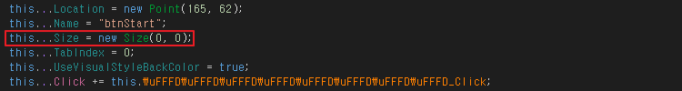
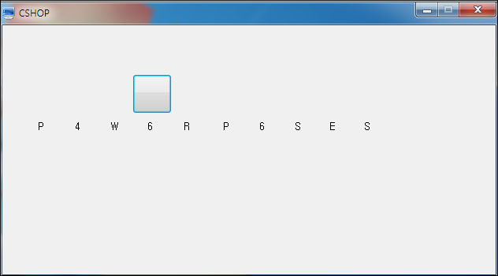

# CSHOP

문제에 대한 별도의 설명은 없으며, 특정 프로그램을 하나 제공해준다.

해당 프로그램을 실행 시, 빈 화면만을 출력한다. 조작하여 플래그를 알아내야한다.

&nbsp;

# 풀이

푸는 방법은 엄청 간단한다. C# 프로그램에 대한 기초적인 분석 능력을 요구하는 문제로 보여진다.

메인 부분을 살펴보면 크기가 0 인 버튼이 존재하는 것을 볼 수 있다. < 1.png 참조 >

&nbsp;

이 크기를 조작하여 실행을 시키면 버튼이 보여지고, 클릭하면 플래그를 출력한다.

	
&nbsp; 

FLAG : **P4W6RP6SES** 