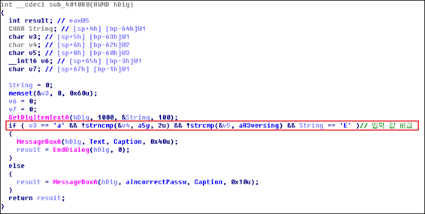

# Easy Crack
이 문제는 사용자로부터 특정 값을 입력 받는다. 

프로그램에서 요구하는 값을 입력한다면, "Congratulation !!" 메시지 박스를 출력한다.

&nbsp;
# 풀이

사용자 입력 값과 프로그램에서 요구하는 값을 검증하는 함수는 "0x401080" 이다. < 1.png 참조 >

디버깅 한 결과를 요약하면,
	
* offset 0 : 'E'
* offset 1 : 'a'
* offset 2~3 : '5y'
* offset 4~12 : 'R3versing

&nbsp;

	
&nbsp; 

FLAG : **Ea5yR3versing** 