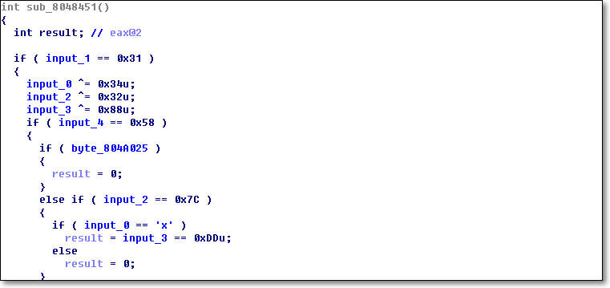

# Easy ELF
이 문제는 사용자로부터 특정 값을 입력 받는다. 

프로그램에서 요구하는 값을 입력한다면, "Correct!" 메시지 박스를 출력한다.

&nbsp;
# 풀이

별도의 패킹이나 안티디버깅이 적용되어 있지 않아 매우 간단하다.

검증로직은 다음과 같다. < 1.png 참조 >

* 1 번째 문자 : Key[0] ^ 0x34 = 0x78
* 2 번째 문자 : 0x31
* 3 번째 문자 : Key[2] ^ 0x32 = 0x7C
* 4 번째 문자 : Key[3] ^ 0x88 = 0xDD
* 5 번째 문자 : 0x58

&nbsp; 

FLAG : **L1NUX** 