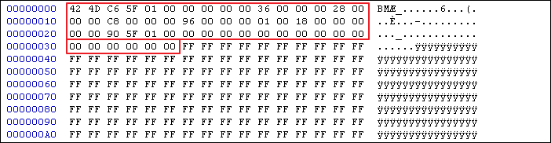

# ImagePrc

이 문제는 사용자로부터 마우스로 선을 그을 수 있는 칠판(?)을 제공한다.

"Check" 버튼을 통해 그림이 프로그램이 요구하는 조건에 부합하는지 검증을 한다. 

&nbsp;

# 풀이 

"Check" 버튼 검증 실패 시, "Wrong" 문자열을 출력한다. 

이를 토대로 "Wrong" 문자를 출력하는 코드의 분기를 찾는 것으로 접근했다.

&nbsp;

빨간색 박스는 bmp 파일의 헤더를 구성하는 부분이고, 초록색 박스는 픽셀 데이터를 비교하는 구문이다. < 1.png 참조 >

&nbsp;

위에서 얻은 정보( bmp 파일 헤더 + 픽셀 데이터 )를 바탕으로 bmp 파일을 구성할 수 있다. < 2.png, 3.png 참조 >

* BMP File Format : http://www.fastgraph.com/help/bmp_header_format.html

&nbsp;

FLAG : **GOT**