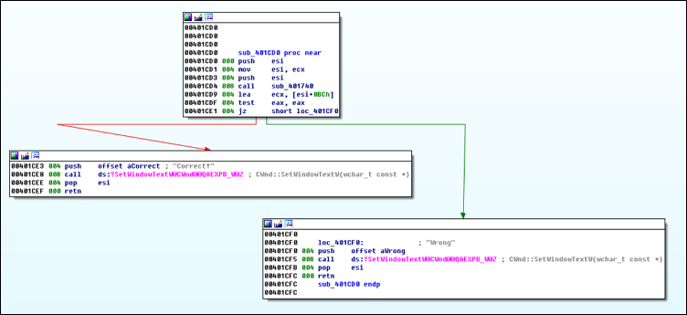
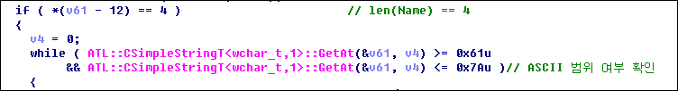

# Position

이 문제는 사용자에게 Serial 값을 제공해주고, 해당 Serial 값일 때의 Name 을 요구한다.

&nbsp;
# 풀이

0x401CD0 의 함수 내부에서는 0x401740 함수를 호출한 리턴 값에 따라 일치 여부를 결정한다. < 1.png 참조 >

즉, 0x401740 함수 내부를 분석하면 Serial 값에 해당하는 Name 을 알아낼 수 있다. > hint : ***p

&nbsp;

* Name 의 길이는 4 글자이며, a-z 까지 범위인지 확인한다. < 2.png 참조 >

	
&nbsp;

* 0 번째 글자와 1 번째 글자 각각 특정 연산을 거친다. 그리고 각각의 연산 결과 값을 더하여 Serial 값과 비교한다. < 3.png 참조 >

	

&nbsp;
위의 연산을 코드로 작성하면 몇몇의 결과가 나온다. < run.py 참조 >
	
&nbsp;

FLAG : **bump**