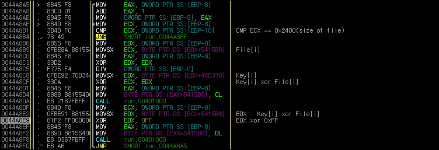
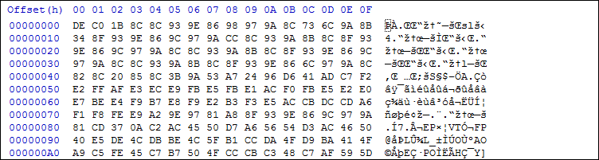

# Ransomware

이 문제는 사용자로부터 KEY 를 입력받아 암호화 된 파일을 복구해주는 실행파일과 암호화 된 파일을 제공한다.

&nbsp;
# 풀이

우선, 문제의 힌트는 암호화 된 파일이 실행 파일임을 알려준다.

사용자로부터 Key 입력 받는 부분에 Breakpoint 를 걸고, 조금 내려가다보면 복호화 로직을 볼 수 있다. < 1.png 참조 >

* Decrypt : (Key[i] xor File[i]) xor 0xFF

&nbsp;

암호화 된 바이너리는 다음과 같다. < 2.png 참조 >

	
&nbsp;

실행파일은 0x4D5A(MZ) 시그니처를 가진다. 즉, (Key[i]) xor File[i]) xor 0xFF = 0x4D 가 되어야 한다.

이러한 방법으로 KEY 값을 알아낼 수 있다.

* Key[0] = 0x6C('l')

* Key[1] = 0x65('e')

. . .

* Key[12] = 0x73('s')

**KEY : letsplaychess** 

복호화 된 파일을 실행시키면 플래그를 출력한다.

&nbsp;

FLAG : **Colle System**