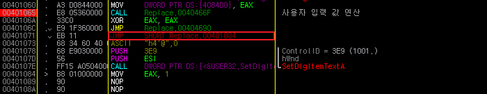

# Replace
이 문제는 사용자로부터 숫자를 입력받고, 프로그램에서 요구하는 숫자라면 "Correct" 를 출력한다.

&nbsp;
# 풀이

프로그램 내부에서는 입력한 값을 가지고 아래와 특정 연산을 거친다. 중요한 부분은 "사용자 입력 값" 과의 연산을 통해 나온 값에 "NOP"*2 를 삽입한다. 즉, 특정 주소의 코드를 NOP 으로 2byte 만큼 덮어 쓸 수 있다.

```asembly
# MOV	[0x4084D0], EAX(사용자로부터 입력받는 값)
# MOV	[0x406016], 619060EB

# INC	[0x4084D0]
# INC	[0x4084D0]

# ADD	[4084D0], 0x601605C7

# INC	[0x4084D0]
# INC	[0x4084D0]
# MOV	EAX, [0x4084D0]

# MOV	[40466F], C39000C6

# MOV   [EAX], 90
# INC   [EAX]
# MOV   [EAX], 90
```

&nbsp;

0x401071 의 "EB 11" 의 값을 "90 90" 으로 덮어쓸 경우, 프로그램에서 "Collect" 를 출력해준다. < 1.png 참조 >



X (사용자 입력 값) + 0x601605c7 + 4 = 0x401071
X = 0x401071 - 0x601605ca (-1607857497)

현재 음수 결과 값를 양수로 바꿔주어야 하기 때문에, unsigned 범위의 최대 값과 더하기하여 X 를 구했다.
X = -1607857497 + 4294967295 (2687109798)

&nbsp;

FLAG : **2687109798**